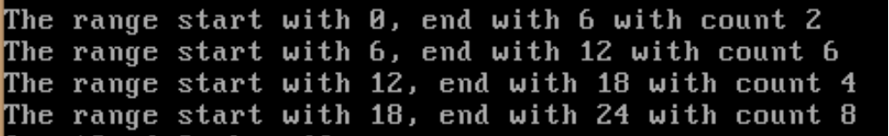

# Parallel-Processing_Histogram_MPI and OPENMP
A Frequency Histogram is a special graph that uses vertical columns to show frequencies (how many times each score occurs):

## How To Run :

  1-you must have a virtual machine

  2-to compile code : mpicc -fopenmp FILENAME.c

  3-to set number of threads : export OMP_NUM_THREADS= Any Number

  4-to run : mpiexec -n __ numberOfProcesses __ ./a.out 

## Input :
  
  1-Number Of Bars
  
  2-Number Of Points
  
  3-Number Of Threads
  
  4-Number Of Processes
  
  5- file contain data set to do statistics about groups
  
## Example :

   if Number Of Bars =4 , Number Of Points=20 , Number Of Threads=4, Number Of Processes=4
  
   and Data Set is : 10-11-12-13-14-21-22-23-24-1-10-11-12-13-14-21-22-23-24-1
   
## Output : 
   
   

  
## See Also:

  * [Sum-of-Convergent-Series Using MPI](https://github.com/MarwanaMostafa/Parallel-Processing-Sum-of-Convergent-Series-MPI)

  * [K-means-Clustering Using OpenMp](https://github.com/MarwanaMostafa/Parallel-Processing_K-means-Clustering_OpenMp)

  * [Divide Data by standard function Using MPI](https://github.com/MarwanaMostafa/Parallel-Processing-Sum-of-Convergent-Series-MPI/tree/main/Divide%20Data%20By%20Standard%20Function)

